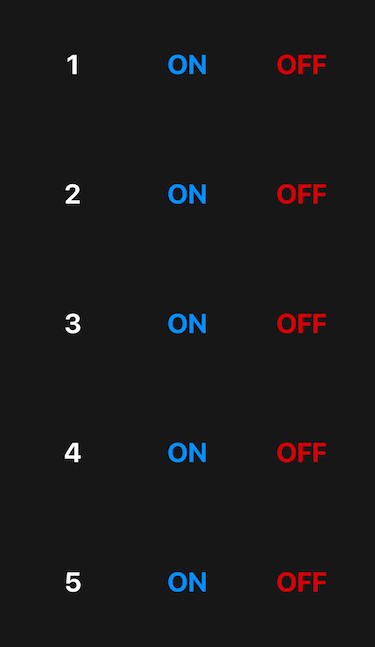
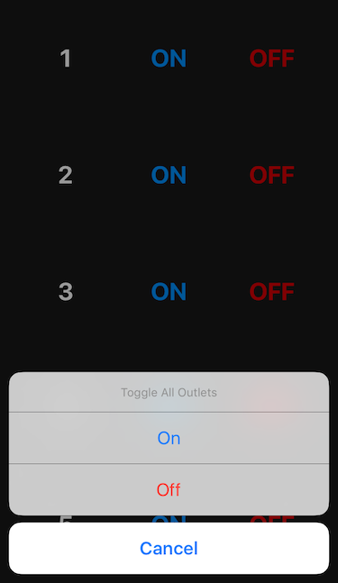
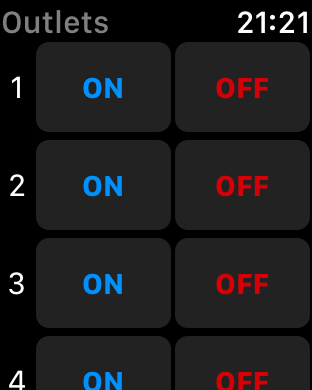
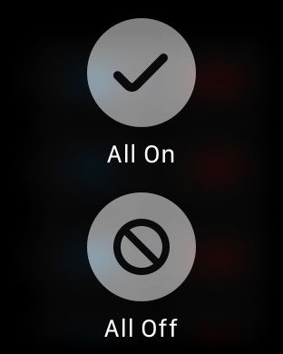

# Outlets
An `iOS` and `watchOS` app for controlling [Etekcity Wireless Electrical Outlets] (http://www.etekcity.com/product/100068.html) through [RFOutlet] (https://github.com/timleland/rfoutlet).

## iOS

## watchOS

## Features
* Split-screen support
* Notification center widget
* Long press in iOS or force touch in watchOS to toggle all outlets
* URL launch scheme for integrating with third-party applications

## License
* Licensed under the MIT License
